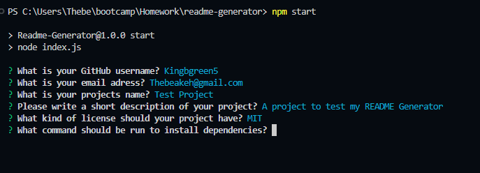

# README Generator
A program which generates a readme based off of user inputed data.

## Description
Uses Inquirer.js to ask the user questions about their project. It then fills in the information into the readme.

## Installation
Run  'npm i'  to install dependencies.

## Usage
Input 'npm start'  to initiate the program.

Link to walkthrough video.
https://drive.google.com/file/d/19bhmU5MSvdHVm6TJaJFfqAmzDhiQwrnp/view

=======

## Credits
Example code provided by Bootcamp lessons.

Inquirer.js

## License
MIT
